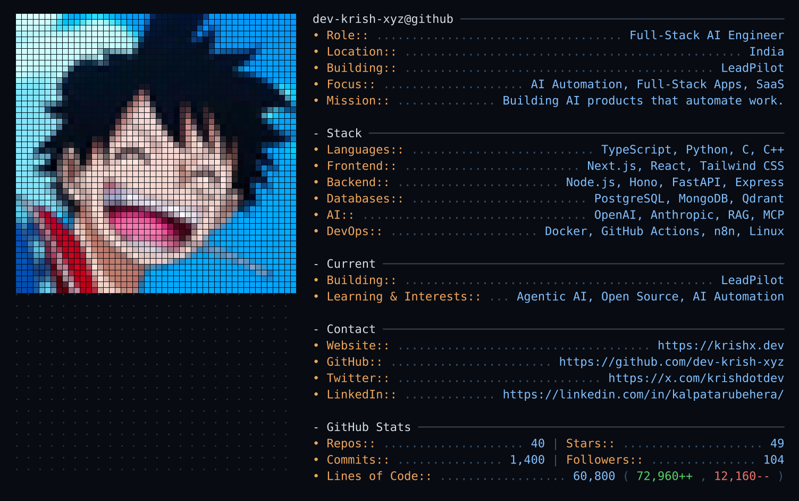

  <!-- Single generated SVG: neofetch-style profile card with a vector avatar mosaic. -->
  

<!--
  The card above is generated, not hand-written. Run `npm run generate` (or the
  scheduled GitHub Action) to rebuild assets/profile.svg from src/. See the
  module layout in src/ — data, layout, rendering, svg, image, github, config.
-->
